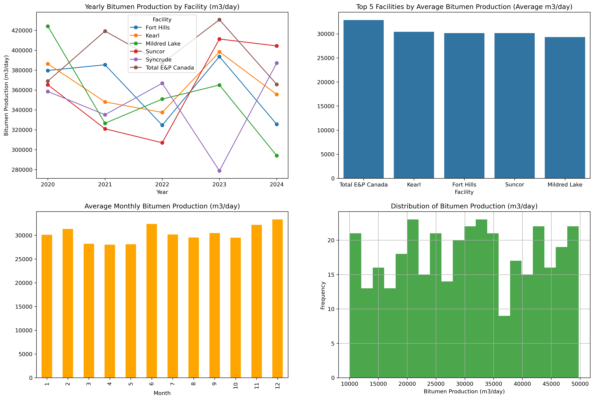

# 🛢️ Oil Sands Bitumen Production Analysis


---

## 📌 Project Overview

This project analyzes **bitumen production trends across major oil sands facilities** using Python.

It demonstrates a complete **data analysis workflow**:

* Data generation
* Cleaning and preprocessing
* Aggregation
* Visualization

The final output is a **multi-panel analytical dashboard** designed to mimic real-world production reporting in the energy sector.

---

## 🎯 Objectives

* Analyze **yearly and monthly production trends**
* Compare **facility performance**
* Explore **distribution and variability**
* Build a **professional analytical dashboard**

---

## 📊 Dashboard Overview

### 🔹 1. Yearly Production Trend

* Multi-line time series
* Shows production trends for each facility

### 🔹 2. Top Facilities by Average Production

* Bar chart ranking facilities

### 🔹 3. Monthly Production Trend

* Captures seasonal patterns

### 🔹 4. Production Distribution

* Histogram of production variability

---

## 🖼️ Visual Output


```text

```


---

## 🗂️ Project Structure

```text
oil-sands-production-analysis/
│
├── notebooks/
│   └── Oilsands_Production_Portfolio_DataAnalysis.ipynb
│
├── src/
│   └── bitumen_analysis.py
│
├── outputs/
│   └── figures.png
│
├── requirements.txt
└── README.md
```

---

## 🔍 Dataset Description

Synthetic dataset representing oil sands production.

| Column      | Description         |
| ----------- | ------------------- |
| Date        | Monthly timestamp   |
| Year        | Extracted year      |
| Facility    | Production site     |
| Bitumen_m3d | Production (m³/day) |

---

## ⚙️ Technologies Used

* Python
* Pandas
* NumPy
* Matplotlib

---

## 🧠 Methodology

1. Generate synthetic production data
2. Clean and preprocess dataset
3. Aggregate production:

   * Yearly totals
   * Monthly averages
   * Facility comparisons
4. Visualize results using Matplotlib

---

## 📈 Key Insights

* Production varies significantly across facilities
* Some facilities consistently outperform others
* Monthly trends suggest potential seasonality
* Distribution shows wide variability

---

## 🚀 How to Run

### Clone repository

```bash
git clone https://github.com/your-username/oil-sands-production-analysis.git
cd oil-sands-production-analysis
```

### Install dependencies

```bash
pip install -r requirements.txt
```

### Run notebook

```bash
jupyter notebook
```

---

## 🔥 Skills Demonstrated

* Time-series analysis
* Data aggregation & transformation
* Multi-panel visualization
* Debugging & data cleaning
* Analytical storytelling

---

## 📌 Future Improvements

* Integrate real production datasets
* Add forecasting (ARIMA / ML)
* Build interactive dashboards
* Deploy as a web app

---

## 👤 Author

**Stephen M**

---

## ⭐ If you found this useful

Give the repo a star ⭐

---
